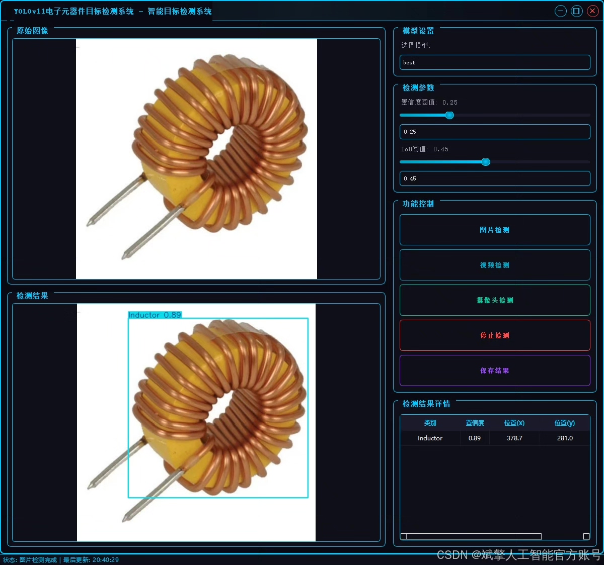
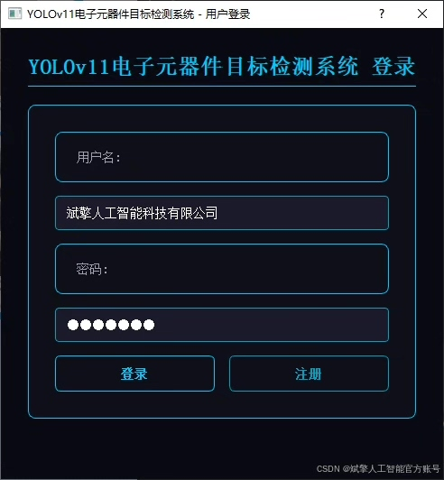
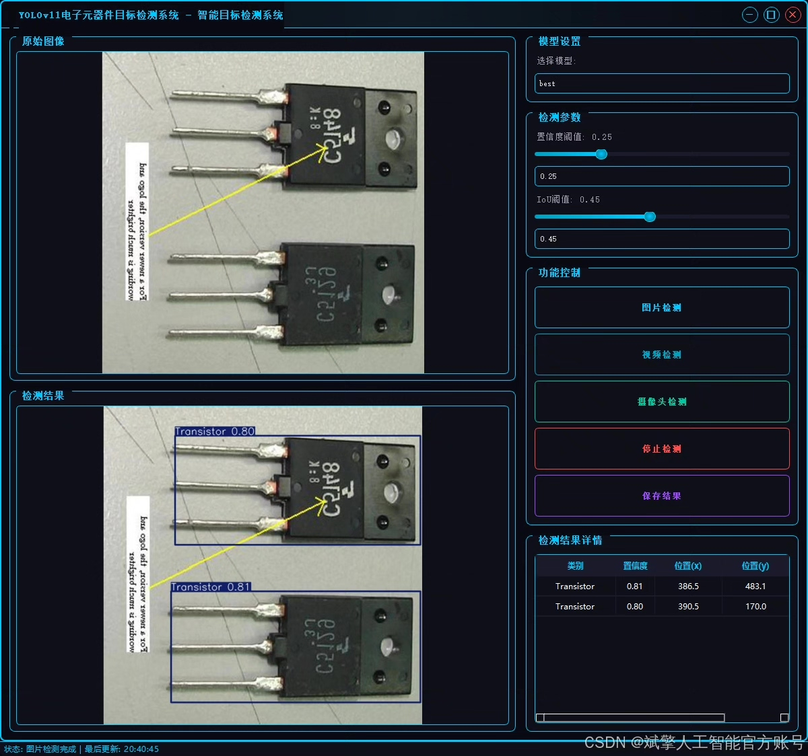
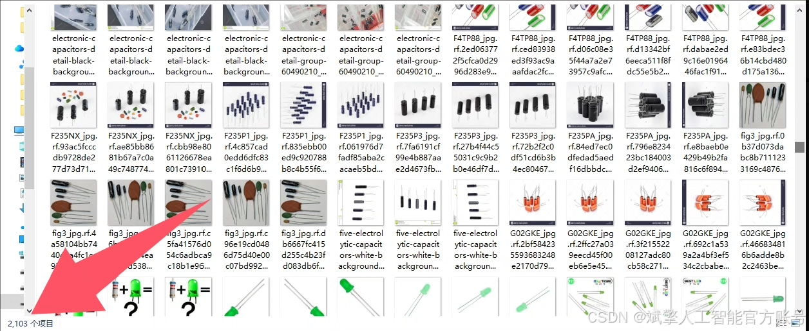
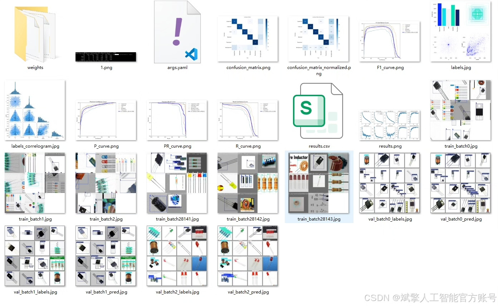
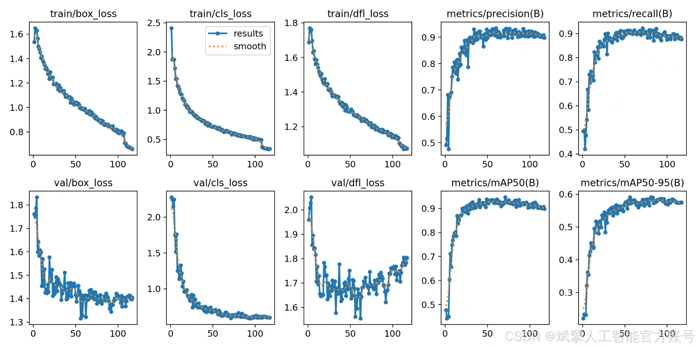
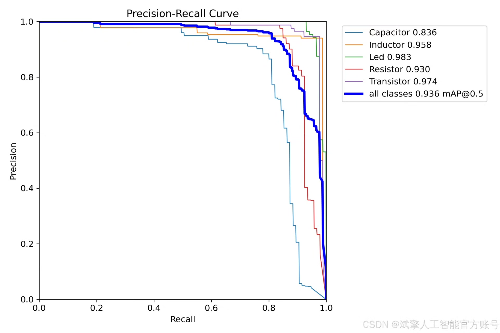
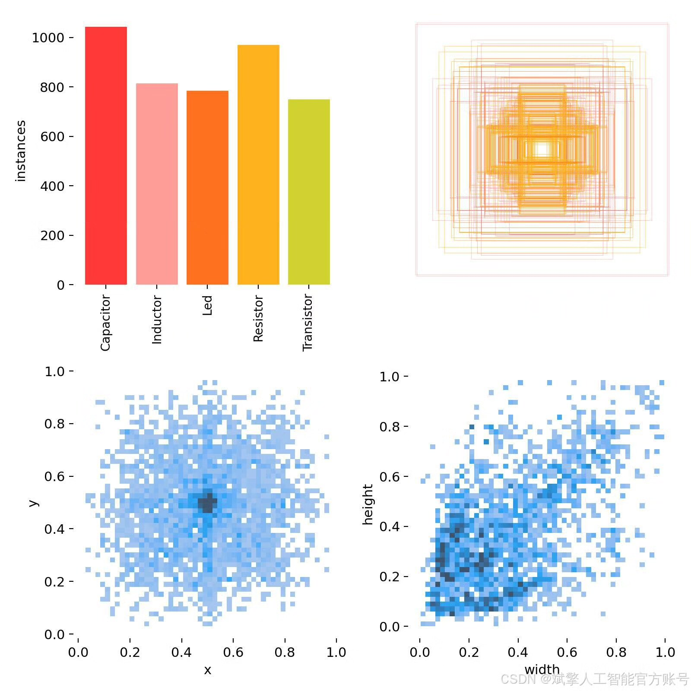
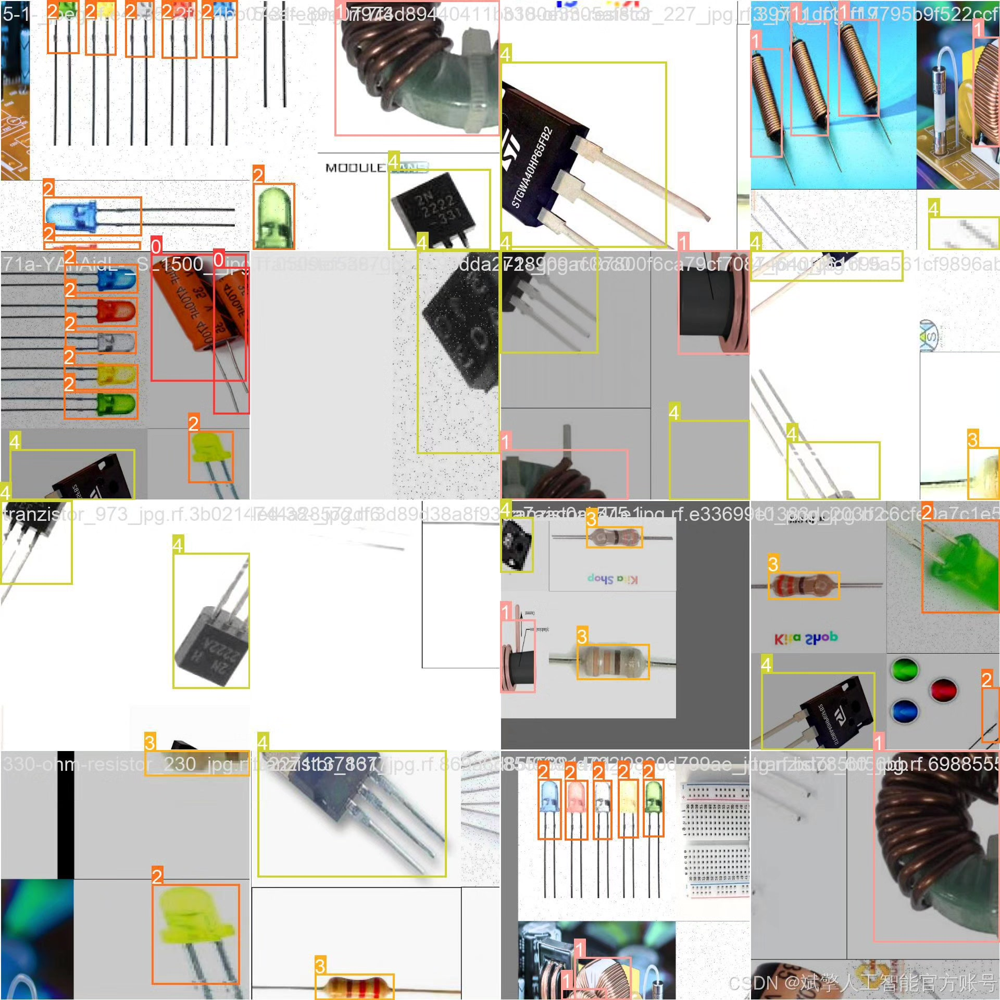

# YOLOv11 Vision Object Detection System

## Body

YOLOv11 Component Recognition and Detection System Based on Deep Learning YOLOv11

This paper designs and implements a system for automatic recognition and detection of electronic components based on the deep learning algorithm YOLOv11, aiming to enhance the accuracy and efficiency of classification and localization of electronic components. The system is centered around the YOLOv11 core detection model, supporting real-time recognition of five types of electronic components: capacitors (Capacitor), inductors (Inductor), LEDs (Led), resistors (Resistor), and transistors (Transistor). The project includes complete Python implementation code, YOLO format labeled dataset (2103 training images, 226 validation images, 97 test images), and a user-friendly UI interface with login and registration functions. Experiments show that the system achieves high detection accuracy and robustness on the test set, and can be applied to board quality inspection, electronic teaching aids, etc., providing a feasible technical solution for industrial automation and intelligent education.

Dataset:
nc: 5
names: ['Capacitor', 'Inductor', 'Led', 'Resistor', 'Transistor'],
dataset quantity: 2103 training images, 226 validation images, 97 test images

✅ User login registration: Supports password detection and security verification.
✅ Three detection modes: Based on the YOLOv11 model, supports image, video, and real-time camera detection, accurately recognizing targets.
✅ Dual-screen comparison: Displays original images and detection results on the same screen.
✅ Data visualization: Real-time table displaying the category, confidence, and coordinates of detected targets.
✅ Intelligent parameter adjustment: Offers a confidence slide bar, dynamically optimizing detection accuracy to meet different scene needs.
✅ Sci-fi style interactive interface: Dark theme combined with dynamic light effects, reducing visual fatigue and improving operational experience.

## Images

## Payment

Here is a pay link on Stripe ( https://buy.stripe.com/3cs8yP7sY87d0vu9AB ). Please contact me lonlonago@foxmail.com after funding $89, and I will send you a complete data files , thank you!

